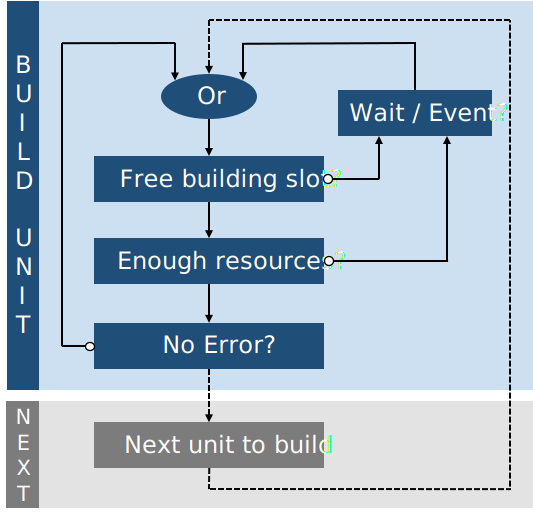

# OGame Python Bot Commander <!-- omit in toc -->

## Pitch <!-- omit in toc -->

The goal of this project is to create a program that plays OGame by building, farming players, launching explorations, watching for incoming fleets and ghosting ships and resources automatically. A bot constraint is to play using the same interface as a human player would use: a single page on a web browser. No hidden HTTP requests, but only visible actions such as clicking buttons and filling forms.


>Figure 1: OGamePythonBot Icon.

Disclaimer: Scripts and bots are forbidden on OGame.

- [More about OGame](https://gameforge.com/fr-FR/play/ogame)

## Table of Contents <!-- omit in toc -->

- [Project environment](#project-environment)
- [Deploying OGame Python Bot Commander](#deploying-ogame-python-bot-commander)
- [Usage](#usage)
- [Results](#results)
- [How it works](#how-it-works)
  - [Selenium WebDriver](#selenium-webdriver)
  - [Processes](#processes)
  - [Building](#building)
  - [Watching fleets](#watching-fleets)
  - [Farming and exploring](#farming-and-exploring)
  - [Sending information on Telegram](#sending-information-on-telegram)
- [More](#more)
- [Authors](#authors)

## Project environment

| Purpose    | Software |
| :--------- | :------- |
| Versioning | Git      |
| Developing | VSCode   |
| Language   | Python 3 |
| Library    | Selenium |
| Figures    | SVG      |

## Deploying OGame Python Bot Commander

```Shell
In progress.
```

## Usage

Using the file [unit.py](unit.py), create lists of items to build for each planet.

```Python
"""Create your build order for each planet here"""
# Buildings have to be written in the same language as your server

# Here write the list of items to build on the mother planet
planet1 = [
    'Centrale électrique solaire',
    'Mine de métal',
    'Mine de cristal'
]
# Here write the list of items to build on the first colony
planet2 = [
    'Centrale électrique solaire',
    'Mine de métal',
    'Mine de cristal'
]
# Other Planets build orders...

# Here add all lists to the main building list
build_order = [planet1, planet2]
```

Then create fleets to send from any planet to any destination for a chosen mission.

```Python
"""Create your fleet orders"""
# Units have to be written in the same language as your server

# Here write the list of ships and their amount that have to be sent
attack_fleet_1 = [
    ('Petit transporteur', 5)
]
attack_fleet_2 = [
    ('Grand transporteur', 1)
]
explore_fleet_1 = [
    ('Grand transporteur', 20),
    ('Éclaireur', 1),
    ('Sonde d`espionnage', 1)
]
explore_fleet_2 = [
    ('Éclaireur', 1),
    ('Petit transporteur', 30)
]
# Other fleets...

# Here create fleet orders choosing the origin planet, type of mission,
# destination and ships to send
# 'coordinates':(galaxy, system, position, origin_type, destination_type)
fleet1 = {
    "origin_planet": 0,
    "mission": 1,
    "coordinates": (1, 100, 4, 1, 1),
    "list_ships": attack_fleet_1,
}
fleet2 = {
    "origin_planet": 0,
    "mission": 1,
    "coordinates": (1, 100, 5, 1, 1),
    "list_ships": attack_fleet_1,
}
fleet3 = {
    "origin_planet": 0,
    "mission": 1,
    "coordinates": (1, 100, 6, 1, 1),
    "list_ships": attack_fleet_2,
}
fleet4 = {
    "origin_planet": 1,
    "mission": 1,
    "coordinates": (1, 101, 16, 1, 1),
    "list_ships": explore_fleet_1,
}
# Here add all fleets to the main fleet list
fleet_order = [fleet1, fleet2, fleet3, fleet4]
# Here add all fleets to the ghosting fleet list
ghost_order = [fleet1, fleet2]
```

## Results

The Bot was tested for 40 days on a collector class account. A human was also playing to colonize, find inactive players to attack, fulfill the quests for rewards and adapt build order.
When under attack after receiving a warning message from the bot on telegram, a human decided on how to spend resources best.
After this period the bot, with this little help, climbed 140th out of more than 3000 players. It is important to know that the top 100 first players get help with paying content called "Dark Matter", and it is hard to reach this rank without paying and on a collector account.


>Figure 2: Bot ranking after 40 days playing.

## How it works

This section describes the main program operation, from its interface with OGame to how different threads run to execute various tasks in parallel.
One major difficulty is that at any time the bot can be disconnected, the server reloaded or an unpredicted error can occur. The bot adapts by trying to complete the task several times, reloading pages and starting over is necessary.

### Selenium WebDriver

The Selenium WebDriver Python library is a tool that uses a browser automation API to control the browser. It is mainly used to run automatic tests on web applications.
Here, it is going to be used as the interface between the OGame website and the python bot to get information about the account and interact with it doing some actions such as building units and attacking.

- [More about Selenium WebDriver](https://www.selenium.dev/documentation/en/webdriver/)

### Processes

One constraint is for the program to use only one tab of the browser so its behavior seems more human-like. Therefore, different actions must be proceeded one after another and not simultaneously.
The program runs different threads corresponding to each action to perform, and a shared mutex is there so when one thread is working with OGame's interface the other wait for their turn.


>Figure 3: Thread Manager.

The bot is working on the following actions, each one executed in a specific thread.

- Building units (buildings, ships, defenses and researches) for a specific planet. There are as many different threads as planets.
- Watching for new fleet events, sending a message if an enemy is attacking and ghosting fleet.
- Farming inactive players or specific targets, sending explorations and ghosting fleet.

### Building

The player gives a build order list of buildings, researches and units for each planet. The bot will build them in order, waiting for resources or for the next item to be over if needed. If an event occurs such as a fleet landing, the bot will re-estimate if the item can be built or compute its remaining waiting time again.


>Figure 4: Builder state diagram.

### Watching fleets

Periodically, with a certain given time, the bot parses the fleet events to prevent attacks and to be notified when one event is complete.
If a new attack is detected, a message is automatically written to the enemy, saying that no resources will be there at his arrival, forcing him to retreat. If he decides to attack anyway, right before the impact all fleet and the maximum of carriable resources will be sent away and the rest converted in defenses or some chosen low-cost units (That part has not been implemented yet).


>Figure 5: Event Watcher.

### Farming and exploring

The player gives a list of inactive players to farm and explorations to do. The bot parses this list and, every time a slot is free, sends the corresponding mission with the chosen ships. When a certain hour of the day arrives the player can choose to automatically ghost fleet and resources instead. After a night of ghosting the usual farming will resume.


>Figure 6: Fleet Sender.

### Sending information on Telegram

The bot can notify the player on events such as a complete building, an attack or internet connection troubles. It is connected to a Telegram bot and sends this information directly to the player's smartphone or watch.


>Figure 7: Snapshot of the telegram OGameBot interface.

- [More about Telegram](https://telegram.org)

## More

Improvable features:

- Automatically parsing the universe to create a list of interesting inactive players to farm.
- Compute the best item to build next.
- Exchange resources between planets to build more efficiently.
- Colonize new planets without the player's help.
- Collect debris field after attacks or explorations if any created.
- Give new instructions to the bot using Telegram such as:
  - Add, remove or change items from building lists.
  - Add, remove or change targets for farming and exploration.
- Detect occasional events such as:
  - A targeted planned getting destroyed.
  - A targeted player becoming too low to be attacked anymore.

## Authors

Florian Mercier
